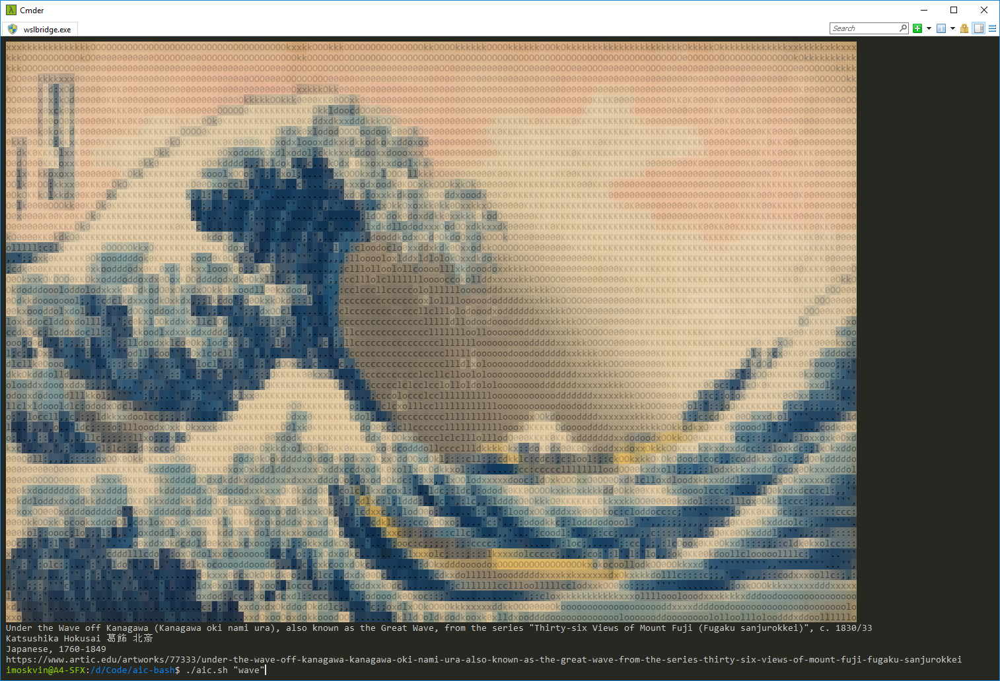

# aic-bash
> A bash script to query our API for artworks and render them as ASCII art

Just a small side-project we did to show what could be done with our API.




## Requirements

 * A terminal with [truecolor (24bit) support](https://gist.github.com/XVilka/8346728) (recommendations below)
 * [Bash v4.2](https://www.tldp.org/LDP/abs/html/bashver4.html#AEN21220) (Feb. 2011) or higher
 * [coreutils](https://www.gnu.org/software/coreutils/) (for [realpath](https://unix.stackexchange.com/questions/101080/realpath-command-not-found))
 * [jq](https://stedolan.github.io/jq/)
 * [jp2a](https://csl.name/jp2a/)

**Not all terminals support truecolor!** See [TrueColor.md](https://gist.github.com/XVilka/8346728) for more information.

New to the command-line life? From testing, we recommend the following:

 * **macOS**: [iTerm2 v3](https://www.iterm2.com/)
 * **Win 10**: [Cmder + WSL](https://conemu.github.io/en/BashOnWindows.html#true-color) (see [Maximus5/ConEmu#920](https://github.com/Maximus5/ConEmu/issues/920))

Note that the default [Terminal.app](https://en.wikipedia.org/wiki/Terminal_(macOS)) which ships with macOS does *not* support truecolor.

Likewise, macOS's default bash is locked to `3.2.57(1)-release` due to licensing issues. Instructions for upgrading:

 * [macos - Update bash to version 4.0 on OSX - Ask Different](https://apple.stackexchange.com/questions/193411/update-bash-to-version-4-0-on-osx)

Lastly, **jq** and **jp2a** must be reachable via `$PATH`. You can install them using a package manager of your choice.

```bash
# macOS with Homebrew
brew install jq jp2a coreutils

# Ubuntu with APT
sudo apt-get install jq jp2a coreutils
```


## Installation

For now, just clone this repository to wherever you store code on your system:

```bash
git clone git@github.com:art-institute-of-chicago/aic-bash.git
```

If you'd like to run `aic.sh` from anywhere, you can add the repository directory to your `$PATH`:

```bash
# Add this to your ~/.bashrc or equivalent, then open a new terminal instance
export PATH=/path/to/aic-bash:$PATH
```

You can also run `aic.sh` when you start a new terminal session:

```bash
# Add this to your ~/.bashrc or equivalent, then open a new terminal instance
/path/to/aic-bash/aic.sh --quality medium
```

Adjust `quality` to reduce color artifacts or improve performance.


## Usage

```bash
$ ./aic.sh -h
usage: aic.sh [options] [query]
  -c, --cache [num]     Cache results of this query for [num] seconds.
                        [num] defaults to 1 hour (3600 sec) if blank.
                        Use cached results if available.
  -i, --id <id>         Retrive specific artwork via numeric id.
  -j, --json <path>     Path to JSON file containing a query to run.
  -l, --limit <num>     How many artworks to retrieve. Defaults to 1.
                        One random artwork from results will be shown.
  -n, --no-fill         Disable background color fill.
  -q, --quality <enum>  Affects width of image retrieved from server.
                        Reduces color artifacts. Valid options:
                          h, high   = 843x (default)
                          m, medium = 400x
                          l, low    = 200x
  -s, --seed <val>      For random queries. Defaults to timestamp.
  [query]               (Optional) Full-text search string.
```

`aic.sh` has four modes of operation:

 1. Running it without any arguments will return a random public domain oil painting.

 2. Running it with the `-i` or `--id` option will look up a specific artwork by its identifier:

    ```bash
    # Nighthawks by Edward Hopper
    ./aic.sh --id 111628
    ```

 3. Running it with a string argument will perform a full-text search and show the first result:

    ```bash
    # The Bedroom by Vincent Van Gogh
    ./aic.sh bedroom

    # Be sure to use quotes when searching for phrases!
    ./aic.sh "american gothic"

    # With --limit, show a random artwork from the top <num> results
    ./aic.sh --limit 10 "mountains"
    ```

 4. Running it with `-j` or `--json` will query our API using a query stored in the specified JSON file:

    ```bash
    # Just some example queries we included for reference
    ./aic.sh --json "queries/default-random-asian-art.json"
    ./aic.sh --json "queries/default-random-landscapes.json"
    ```

Under the hood, all of its queries are stored as JSON files in the `./queries` directory.

We treat JSON files as query templates. Before executing a JSON query, we replace the following text:

 * `VAR_FULLTEXT` is replaced by whatever is specified in the `[query]` argument
 * `VAR_SEED` is replaced by the value of the `--seed` option or the current Unix timestamp
 * `VAR_LIMIT` is replaced by the value of the `--limit` option
 * `VAR_ID` is replaced by the value of the `--id` option

So if the query supports it, you can combine `--json` with full-text search:

```bash
# Flower Girl in Holland by George Hitchcock
./aic.sh --json "queries/default-fulltext-landscape.json" "holland"
```

If you want to write custom queries for use with `--json`, feel free to store them in the `./queries` directory.

Any file in `./queries` that doesn't begin with `default-*` will be ignored by version control.

The `--limit <num>` option provides a way to randomize search, assuming that the query in question uses `VAR_LIMIT`.

Here, "limit" indicates how many results should be returned on each page from the API. Internally, we show a random result from the first page. By default, limit is set to `1`, so the top result will always be shown. Specifying a greater limit means that we will select a random artwork from the top `<num>` results from the API. For performance, limit is capped at 100.

Limit is meant to work primarily in conjunction with full-text search. For example:

```bash
# Show a random artwork from the top 50 results for "paperweight"
./aic.sh --limit 50 "paperweight"
```

If you are writing your own queries, and you'd like to select a random artwork from a category, with no regard to [relevance](https://www.elastic.co/guide/en/elasticsearch/guide/current/relevance-intro.html) or [popularity](https://github.com/art-institute-of-chicago/data-aggregator/blob/3b80579b0840fcbbff589b1b26a2bd6aec5bade0/app/Models/Collections/Artwork.php#L616-L629), consider avoiding the use of `VAR_LIMIT`. Instead, use [term](https://www.elastic.co/guide/en/elasticsearch/reference/current/query-dsl-term-query.html) queries with [function_score](https://www.elastic.co/guide/en/elasticsearch/reference/current/query-dsl-function-score-query.html) and `"boost": false`. See [queries/default-random-landscape.json](queries/default-random-landscape.json) for an example.

Lastly, `--cache [num]` allows you to cache the API response, so that the script won't have to hit the API each time it runs the same query. This is useful for running full-text search with high limit. For example:

```bash
# Show a random artwork from the top 100 results for "paperweight"
# Results will be cached for 1 day (86400 seconds)
./aic.sh --limit 100 --cache 86400 "paperweight"
```

After running this query once, it will cache the results. If you run it again within the 24-hour window, it'll show a new random paperweight from the top 100 results without needing to re-query the API.

If you use `--cache` without specifying `[num]`, it'll default to 3600 seconds, i.e. 1 hour.
